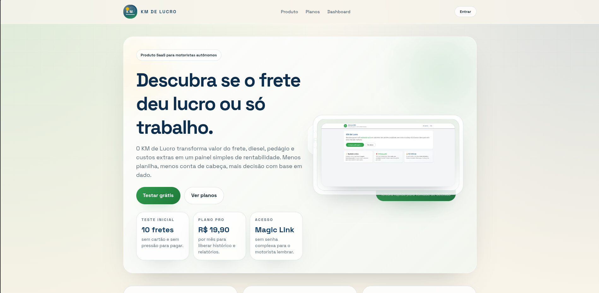

# KM de Lucro

[Português](README.md) | [English](README.en.md)

Aplicação web para motoristas autônomos controlarem faturamento, custos, lucro e margem por frete sem depender de planilhas.



## Visão geral

O KM de Lucro foi pensado para transformar dados básicos da viagem em leitura financeira prática. Em vez de fazer conta de cabeça ou manter planilhas paralelas, o motorista registra cada frete e acompanha o resultado mensal em uma interface direta.

### O que o produto entrega

- Cadastro de fretes com data, origem, destino, KM, valor e custos.
- Cálculo automático de lucro líquido, margem e lucro por KM.
- Resumo mensal com faturamento, custos, quantidade de fretes e evolução do período.
- Exportação em CSV e PDF para controle externo.
- Login por magic link via Supabase Auth.
- Plano gratuito para validação e plano Pro com histórico completo e exportações.

## Stack

- Next.js 16 com App Router
- React 19
- TypeScript
- Tailwind CSS 4
- Supabase para autenticação e persistência de dados
- jsPDF para exportação em PDF

## Pré-requisitos

- Node.js 20 ou superior
- npm 10 ou superior
- Projeto Supabase com autenticação por e-mail habilitada

## Como rodar localmente

1. Clone o repositório:

```bash
git clone https://github.com/rafamolina1/KM-De-Lucro.git
cd KM-De-Lucro
```

2. Instale as dependências:

```bash
npm install
```

3. Crie o arquivo `.env.local` na raiz do projeto:

```env
NEXT_PUBLIC_SUPABASE_URL=https://SEU-PROJETO.supabase.co
NEXT_PUBLIC_SUPABASE_ANON_KEY=SUA_ANON_KEY
SUPABASE_SERVICE_ROLE_KEY=SUA_SERVICE_ROLE_KEY
ADMIN_SECRET=UMA_SENHA_PARA_A_ROTA_ADMIN
NEXT_PUBLIC_SITE_URL=http://localhost:3000
```

4. Configure o Supabase Auth:

- Em `Authentication > URL Configuration`, defina `Site URL` como `http://localhost:3000`.
- Em `Additional Redirect URLs`, adicione `http://localhost:3000/auth/callback`.
- Se você testar pelo IP da rede local, adicione também `http://SEU-IP:3000/auth/callback`.
- Em `Authentication > Providers > Email`, deixe o login por e-mail habilitado.

5. Inicie o servidor de desenvolvimento:

```bash
npm run dev
```

6. Acesse `http://localhost:3000`.

## Variáveis de ambiente

| Variável | Obrigatória | Uso |
| --- | --- | --- |
| `NEXT_PUBLIC_SUPABASE_URL` | Sim | URL pública do projeto Supabase. |
| `NEXT_PUBLIC_SUPABASE_ANON_KEY` | Sim | Chave pública usada pelo cliente web para autenticação e consultas autorizadas. |
| `SUPABASE_SERVICE_ROLE_KEY` | Sim, para a rota admin | Chave de servidor usada pela rota `/api/admin/planos`. Não deve ser exposta no cliente. |
| `ADMIN_SECRET` | Sim, para a rota admin | Segredo simples usado pela área administrativa interna de planos. |
| `NEXT_PUBLIC_SITE_URL` | Recomendado | Base da aplicação para metadados e configuração de ambiente. |

## Estrutura esperada no Supabase

Este repositório pressupõe que o projeto Supabase já tenha, no mínimo, estas tabelas:

- `profiles`, com `id` e `plan`
- `freights`, com `id`, `user_id`, `date`, `origin`, `destination`, `km`, `value`, `diesel`, `tolls`, `other_costs`, `profit` e `margin`

## Scripts disponíveis

```bash
npm run dev
npm run build
npm run start
npm run lint
```

## Área administrativa

A rota `/admin/planos` foi feita para uso interno e depende de `ADMIN_SECRET` e `SUPABASE_SERVICE_ROLE_KEY`. Se o projeto for publicado, vale proteger esse fluxo com uma camada real de autenticação e autorização.

## Deploy

O projeto pode ser publicado na Vercel com a configuração padrão do Next.js.

Antes do deploy:

- replique as variáveis de ambiente no painel da Vercel
- ajuste `NEXT_PUBLIC_SITE_URL` para o domínio de produção
- adicione a URL de produção com `/auth/callback` no Supabase Auth

## Observação

O repositório contém a aplicação, mas não inclui migrações do banco. Se você for configurar um projeto Supabase do zero, precisará criar o esquema correspondente às tabelas usadas pelo front-end e pela rota administrativa.
